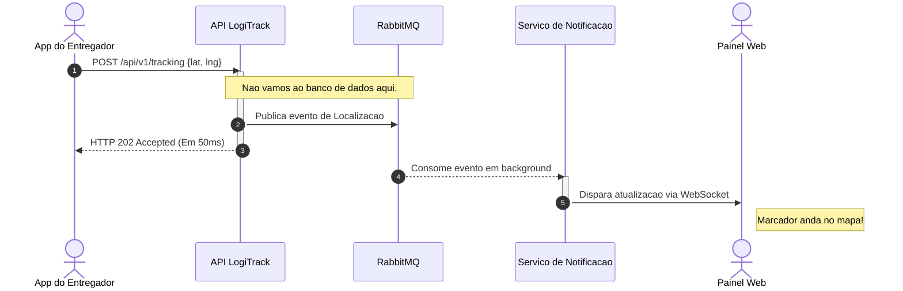
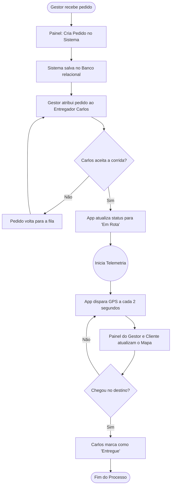

```mermaid
sequenceDiagram
autonumber
actor Carlos as App do Entregador
participant API as API LogiTrack
participant Fila as RabbitMQ
participant Worker as Servico de Notificacao
actor Gestor as Painel Web

Carlos->>API: POST /api/v1/tracking {lat, lng}
activate API
Note over API, Fila: Nao vamos ao banco de dados aqui.
API->>Fila: Publica evento de Localizacao
API-->>Carlos: HTTP 202 Accepted (Em 50ms)
deactivate API

Fila-->>Worker: Consome evento em background
activate Worker
Worker->>Gestor: Dispara atualizacao via WebSocket
deactivate Worker
Note right of Gestor: Marcador anda no mapa!
```

```mermaid
graph TD
    A([Gestor recebe pedido]) --> B[Painel: Cria Pedido no Sistema]
    B --> C[Sistema salva no Banco relacional]
    C --> D[Gestor atribui pedido ao Entregador Carlos]
    D --> E{Carlos aceita a corrida?}

    E -- Não --> F[Pedido volta para a fila]
    F --> D

    E -- Sim --> G[App atualiza status para 'Em Rota']
    G --> H((Inicia Telemetria))

    H --> I[App dispara GPS a cada 2 segundos]
    I --> J[Painel do Gestor e Cliente atualizam o Mapa]

    J --> K{Chegou no destino?}
    K -- Não --> I

    K -- Sim --> L[Carlos marca como 'Entregue']
    L --> M([Fim do Processo])
```
